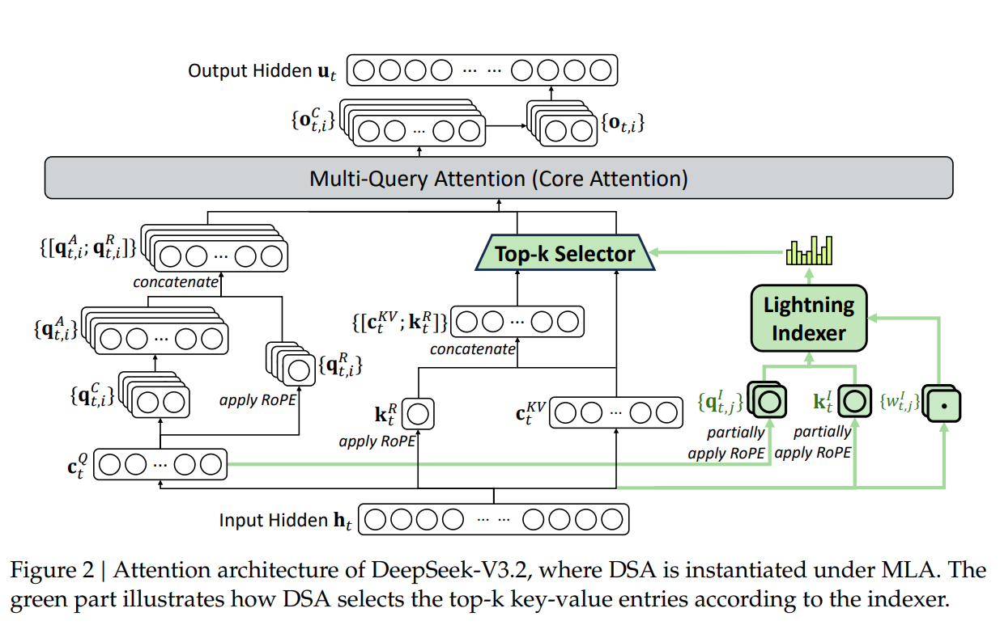

### 1. 国际“御三家”基座大语言模型

#### OpenAI

\[GPT-3\]：Language Models are Few-Shot Learners：2020.6（⭐⭐⭐⭐）

- 开山鼻祖，直接促成了后续ChatGPT的诞生
- 175B参数，上下文学习

\[GPT-4\]：GPT-4 Technical Report：2023.3 （⭐⭐⭐⭐⭐）

- 对ChatGPT技术的全面展示；在此之后OpenAI开始转向商业化，很难再有如此的细节披露了

---

#### Anthropic

The Claude 3 Model Family: Opus, Sonnet, Haiku：2024.3

Introducing Claude 4：2025.5

Introducing Claude 3.5 Sonnet：2024.6

- 确立了Claude在当时Coding模型领域的地位

Introducing Claude Sonnet 4.5: 2025.9

Introducing Claude Opus 4.5：2025.11

- 以上基本没有讲技术细节，就是把benchmark的结果贴了出来
- 可解释性， 安全是Anthropic的关注重点并且在对外宣传中一直被反复强调

Anthropic还有两个博客，会发布一些重要/不重要的技术细节

https://www.anthropic.com/research

https://www.anthropic.com/engineering

#### Gemini

Gemini: A Family of Highly Capable Multimodal Models

- 平平无奇

Gemini 1.5: Unlocking multimodal understanding across millions of tokens of context

Gemini 2.5: Pushing the Frontier with Advanced Reasoning, Multimodality, Long Context, and Next Generation Agentic Capabilities

Gemini 3 [链接](https://blog.google/products-and-platforms/products/gemini/gemini-3/)

- 扭转了Google在大模型领域的颓势，并给OpenAI造成了压力

Gemini 3.1-Pro Model Card: [链接](https://storage.googleapis.com/deepmind-media/Model-Cards/Gemini-3-1-Pro-Model-Card.pdf)

Gemma: Open Models Based on Gemini Research and Technology

Gemma 2: Improving Open Language Models at a Practical Size

Gemma 3 Technical Report

Gemma4 Report [Unofficial Introduction](https://huggingface.co/blog/gemma4)

#### Meta Llama

The Llama 3 Herd of Models: 2024.7 ⭐⭐⭐

- 开源领域重要模型
- 后续的Llama 4 陷入争议，连同arxiv被撤稿

#### Meta Muse

Introducing Muse Spark: Scaling Towards Personal Superintelligence:2026.4

#### Mistral

PENDING

### 2.中国大语言模型

#### Moonshoot Kimi

Mooncake: A KVCache-centric Disaggregated Architecture for LLM Serving: 2025.9

Kimi k1.5: Scaling Reinforcement Learning with LLMs: 2025.1 https://arxiv.org/abs/2501.12599

Kimi K2: Open Agentic Intelligence:  2025.7 https://arxiv.org/abs/2507.20534

Kimi K2.5: Visual Agentic Intelligence: 2026.2 https://arxiv.org/pdf/2602.02276 ⭐⭐⭐⭐ 

- 非常简洁，用的是主流的技术；强调了**token-efficiency**。但是细节不是很多，几乎是一笔带过。而在Agentic Infra上面似乎也没有讲太多东西。

#### 智谱 GLM

GLM: General Language Model Pretraining with Autoregressive Blank Infilling: 2022.5 

Chatglm-rlhf: Practices of aligning large language models with human feedback: 2024.4 

Chatglm-math: Improving math problem-solving in large language models with a self-critique pipeline: 2024.4 

GLM-130B: An open bilingual pre-trained model: 2022.10 

ChatGLM: A Family of Large Language Models from GLM-130B to GLM-4 All Tools: 2024.6 

GLM-4.5: Agentic, Reasoning, and Coding (ARC) Foundation Models: 2025.8 

GLM-5: from Vibe Coding to Agentic Engineering: 2026.2 

- 重点放在了异步RL；

- GLM-5 **On-Policy Cross-Stage Distillation**

  中规中矩，没有太多技术创新；

  Thinking的三种模式似乎只是格式的变化，而且又增加了认知的成本；

  后训练：**IcePop  技巧缓解训推**不一致性；

  DSA=Indexer；

  ORM, PRM, GRM的三重奖励；

  **Code环境：**Repo-Launch

  computationally prohibitive 这个单词太难受了，能不能改成computationally unaffordable。

  异步时，生成一条轨迹的过程中模型可能已更新多次，导致无法精确追踪行为策略的概率 。存储多个旧检查点又不现实。优化1：直接复用生成轨迹时实际使用的 log 概率。优化2：超出clip区间的不参与梯度更新；

#### 深度求索 DeepSeek

DeepSeek-V2: A Strong, Economical, and Efficient Mixture-of-Experts Language Model，2024.5

DeepSeek-Prover: Advancing Theorem Proving in LLMs through Large-Scale Synthetic Data，2024.5

DeepSeek-V3 Technical Report，2024.12

DeepSeekMath: Pushing the Limits of Mathematical Reasoning in Open Language Models，2024.2

DeepSeek-R1: Incentivizing Reasoning Capability in LLMs via Reinforcement Learning，2025.1，⭐⭐⭐⭐⭐

DeepSeek-Prover-V2: Advancing Formal Mathematical Reasoning via Reinforcement Learning for Subgoal Decomposition，2025.4

DeepSeek-V3.2, DeepSeek-V3.2: Pushing the Frontier of Open Large Language Models, 2025.12 ⭐⭐⭐

- Unbiased K3 Estimator

Deepseek-V4（Flash/Pro): 2026.4 ⭐⭐⭐⭐

- 继承了Kimi Muon优化器的衣钵；用到了自己创新的**mHC**；

- Infra 味非常浓，介绍了**EP Scheme**如何通过通信和计算的流水线化降低延迟，**DeepGEMM**的使用；

- 提到了Ascend芯片的适配问题；

- 在算子层面，提到了新锐**TileLang**，这也是北大系的重要贡献；提到了一些虽然看起来像魔法但其实又在情理之中（不代表容易）的技巧；例如紧凑的代码表示，**SMT-Solver-Assisted**技巧；

- 批次不变性：**Batch Invariance**，可能是受到了**Thinking Machine Lab**的影响，希望去掉训练的随机性；这么做的好处是为了方便debug；

- 细粒度的checkpoint机制的微分（本来要用checkpoint减少显存占用，但是checkpoint的粒度太大，计算量增加，所以要手写减少计算量，但是手写又不能自动微分，开发量太大，所以写了个自动微分的方法）；

- CSA, HCA（跟NSA，DSA的关系）；

- XML天然不需要转义；

- loss-spike的解决方法：nticipatory Routing（预期路由） 和 SwiGLU Clamping（SwiGLU 钳位）

- agentic架构的变化；

- **Code环境：**microVM：Firecracker

#### 阿里通义 Qwen

Qwen2-VL, Qwen2-VL: Enhancing Vision-Language Model's Perception of the World at Any Resolution， [博客](https://qwen.ai/blog?id=qwen2-vl) 2024.9

Qwen2.5-VL, Qwen2.5-VL Technical Report，2025.2

Qwen3-VL, Qwen3-VL Technical Report，2025.12

Qwen2-Audio, Qwen2-Audio Technical Report，2024.7

Qwen2.5-Omni, Qwen2.5-Omni Technical Report，2025.3

Qwen3-Omni, Qwen3-Omni Technical Report，2025.9

Qwen2.5-Coder, Qwen2.5-Coder Technical Report，2024.9

Qwen3-Coder-Next, Qwen3-Coder-Next Technical Report，2026.2

Qwen2-Math, Qwen2-Math Technical Report，2024.8

Qwen2.5-Math, Qwen2.5-Math Technical Report，2024.9

Qwen3-Embedding, Qwen3 Embedding Technical Report，2025.6

Qwen3-VL-Embedding, Qwen3-VL-Embedding and Qwen3-VL-Reranker: A Unified Framework for State-of-the-Art Multimodal Retrieval and Ranking，2026.1

Qwen-Image, Qwen-Image Technical Report，2025.8

Qwen3-ASR, Qwen3-ASR Technical Report，2026.1

Qwen3-TTS, Qwen3-TTS Technical Report，2026.1

Qwen3Guard, Qwen3Guard Technical Report，2025.10

QwenLong, QwenLong-L1: Towards Long-Context Large Reasoning Models with Reinforcement Learning，2025.5

Qwen, Qwen Technical Report，2023.9

Qwen2, Qwen2 Technical Report，2024.7

Qwen2.5, Qwen2.5 Technical Report，2024.12

Qwen3, Qwen3 Technical Report，⭐⭐⭐⭐2025.5

- 国内开源第一梯队；超级全家桶；值得一看是Qwen3-VL, Qwen3 Technical Report

#### Seedance/Bytedance

Seed-Prover, Seed-Prover: Deep and Broad Reasoning for Automated Theorem Proving，2025.7

Seed-Prover 1.5, Seed-Prover 1.5: Mastering Undergraduate-Level Theorem Proving via Learning from Experience，2025.12

Seed diffusion: A large-scale diffusion language model with high-speed inference

Seedance 2.0: Advancing Video Generation for World Complexity

- 视频生成领域的第一（2026年）

### 3. 具身智能

#### 阿里-通义千问

2026年 6 月 16 日，阿里正式推出通义千问首款全系列完整具身智能模型 Qwen-Robot，该系列由三款模型构成：分别是依托超 38100 小时开源操作数据完成训练的 VLA 操作模型 Qwen-RobotManip、面向移动场景的 VLN 导航模型 Qwen-RobotNav，以及以自然语言为动作交互接口、融合二十余种机器人本体开展联合训练的世界模型 Qwen-RobotWorld。三款模型既支持单独部署使用，也能够联动协同运行。（来源：机器人全球资讯）

这三篇论文在具身智能业界算得上一股清流，信息密度很大，内容富有借鉴意义

其实从Qwen3-VL技术报告可以看出通义其实内部对多模态已经有相当好的技术积累。所以单纯从VL出发推进的具身智能技术路线有这样的水平并不意外。

**Qwen-RobotNav Technical Report: A Scalable Navigation Model Designed for an Agentic Navigation System**
 arXiv: 2606.18112，2026.6

**Qwen-RobotManip Technical Report: Alignment Unlocks Scale for Robotic Manipulation Foundation Models**
 arXiv: 2606.17846，2026.6

**Qwen-RobotWorld Technical Report: Unifying Embodied World Modeling through Language-Conditioned Video Generation**
 arXiv: 2606.17030，2026.6

**三篇论文的关系**：

| 论文            | 解决的问题             | 对应能力 |
| --------------- | ---------------------- | -------- |
| Qwen-RobotNav   | 机器人如何在环境中移动 | 空间导航 |
| Qwen-RobotManip | 机器人如何操作物体     | 物理交互 |
| Qwen-RobotWorld | 行动后世界会如何变化   | 世界预测 |

---

### 4. 技术总结

模型架构（GDN, DSA, NSA，MoE）

RL 异步框架

大规模预训练

多模态

Agentic技术

数据

## 📚 参考资源

- [arXiv](https://arxiv.org/) - 学术论文
- [Google DeepMind Research](https://deepmind.google/research/)
- [Anthropic](https://www.anthropic.com/)
- [DeepSeek](https://www.deepseek.com/)
- [Qwen](https://qwenlm.github.io/)
- [智谱AI](https://www.zhipuai.cn/)
